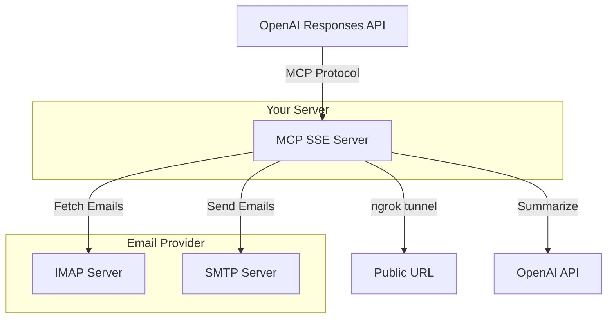
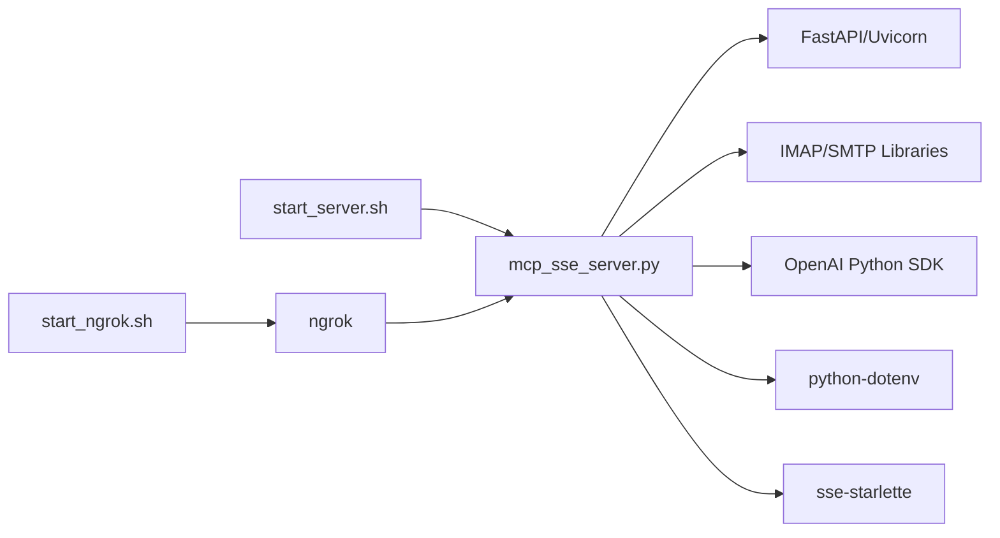

# IMAP Email MCP Server

A Model Context Protocol (MCP) server that enables AI assistants to fetch, summarize, and send emails via IMAP/SMTP. This server exposes two main tools through the MCP protocol for use with OpenAI's Responses API.

## Features

- Fetch emails from IMAP servers within specified time ranges
- AI-powered email summarization using GPT-4o-mini with focus on key points, senders, and action items
- Send emails via SMTP with support for CC, BCC, and HTML content
- MCP protocol over HTTP with SSE support
- OpenAI-Builder MCP compatabilty 
- Ngrok integration for remote access of local running servers

## Architecture



## Dependencies



## Installation

### Prerequisites

- Python 3.8 or higher
- ngrok account with custom domain (for public access)
- IMAP/SMTP email account credentials

### Step 1: Clone or Navigate to Directory

e.g.
```bash
cd /Users/frank/projects/ai-agent/imap-email-mcp
```

### Step 2: Create Virtual Environment

```bash
python3 -m venv venv
source venv/bin/activate
```

### Step 3: Install Python Dependencies

```bash
pip install -r requirements.txt
```

The requirements include:
- `python-dotenv` - Environment variable management
- `openai` - OpenAI API client
- `fastapi` - Web framework
- `uvicorn` - ASGI server
- `sse-starlette` - Server-Sent Events support

### Step 4: Configure Environment Variables

Create a `.env` file in the project directory:

```bash
# OpenAI Configuration (optional)
OPENAI_API_KEY=your_openai_api_key_here

# IMAP Configuration
IMAP_HOST=imap.yourdomain.com
IMAP_USER=your_email@yourdomain.com
IMAP_PASS=your_email_password

# SMTP Configuration
SMTP_HOST=smtp.yourdomain.com
SMTP_PORT=465
EMAIL_FROM_NAME=Your Name

# Server Configuration
FLASK_PORT=5001
FLASK_HOST=0.0.0.0
```

### Step 5: Install ngrok (for remote access)

1. Download ngrok from https://ngrok.com/download
2. Set up a custom domain in your ngrok dashboard (requires paid plan)
3. Make the start script executable:

```bash
chmod +x start_ngrok.sh
chmod +x start_server.sh
```

## Usage

### Starting the MCP Server

Start the server locally:

```bash
./start_server.sh
```

The server will start on `http://localhost:5001`

### Exposing via ngrok

In a separate terminal, start the ngrok tunnel with your custom domain:

```bash
./start_ngrok.sh yourdomain.ngrok.dev
```

Example:
```bash
./start_ngrok.sh frankimap.ngrok.dev
```

Your MCP server is now accessible at `https://yourdomain.ngrok.dev/sse`

### MCP Tools

The server exposes two tools via the MCP protocol:

#### 1. summarize_emails

Fetches and summarizes emails from a specified time range.

**Input Schema:**
```json
{
  "start_iso": "2024-11-25T00:00:00Z",
  "end_iso": "2024-11-25T23:59:59Z"
}
```

**Example Use Case:**
"Show me emails from today" or "Summarize emails from last week"

**Parameters:**
- `start_iso` (required): Start time in ISO 8601 format with Z suffix
- `end_iso` (required): End time in ISO 8601 format with Z suffix

**Response:**
Returns a summary of all emails within the time range, including:
- Number of emails found
- AI-generated summary of email content
- Individual email details (from, subject, date, preview)

#### 2. send_email

Sends an email to one or more recipients.

**Input Schema:**
```json
{
  "to": ["recipient@example.com"],
  "subject": "Hello from MCP",
  "body": "This is the email content",
  "cc": ["cc@example.com"],
  "bcc": ["bcc@example.com"],
  "body_type": "plain"
}
```

**Example Use Case:**
"Send an email to john@example.com with subject 'Meeting Tomorrow' and tell him about the 10am meeting"

**Parameters:**
- `to` (required): Array of recipient email addresses
- `subject` (required): Email subject line
- `body` (required): Email body content
- `cc` (optional): Array of CC recipients
- `bcc` (optional): Array of BCC recipients
- `body_type` (optional): "plain" or "html" (default: "plain")

**Response:**
Returns send status with details:
- Status (success/error)
- Recipients (to, cc, bcc)
- Subject
- Timestamp

## How Email Summarization Works

The `summarize_emails` tool uses a multi-step process to provide intelligent email summaries:

### Step 1: Email Retrieval
- Connects to your IMAP server using provided credentials
- Searches for emails within the specified date range
- Extracts key metadata: sender, subject, date, and body preview

### Step 2: Content Formatting
All retrieved emails are formatted into a structured text block:
```
From: sender@example.com
Subject: Email Subject
Date: 2024-11-25 10:30:00

[Body preview text]

---

[Next email...]
```

### Step 3: AI Analysis
The formatted emails are sent to OpenAI's GPT-4o-mini model with:
- **System Prompt**: Instructs the AI to act as an email summarization assistant
- **Focus Areas**: Key points, senders, and action items
- **Parameters**:
  - Model: `gpt-4o-mini`
  - Temperature: `0.7` (balanced creativity and consistency)
  - Max tokens: `500` (concise summaries)

### Step 4: Structured Response
Returns a JSON object containing:
- Time range queried
- Total email count
- Individual email details (full list)
- AI-generated summary highlighting important information

This approach ensures you get both a quick overview (AI summary) and detailed information (individual emails) for deeper analysis if needed.

## OpenAI Integration

To use this MCP server with OpenAI's Responses API:

1. Start the MCP server and ngrok tunnel
2. Configure your OpenAI assistant with the MCP endpoint:

```json
{
  "type": "mcp",
  "url": "https://yourdomain.ngrok.dev/sse"
}
```

3. The AI assistant can now call the email tools automatically based on user requests

## API Endpoints

- `GET /` - Health check and service information
- `GET /sse` - MCP protocol information
- `POST /sse` - MCP protocol endpoint (JSON-RPC 2.0)
- `POST /tool/summarize_emails` - Direct REST endpoint for email summarization

## Troubleshooting

**Server won't start:**
- Check that port 5001 is available
- Verify all required environment variables are set in `.env`
- Ensure Python dependencies are installed

**ngrok connection fails:**
- Verify your ngrok authentication token is configured
- Check that your custom domain is correctly set up in ngrok dashboard
- Custom domains require a paid ngrok plan

**Email operations fail:**
- Verify IMAP/SMTP credentials are correct
- Check that your email provider allows IMAP/SMTP access
- Some providers require app-specific passwords

**OpenAI summarization fails:**
- Verify your OpenAI API key is valid and has credits
- Check the API key has access to the required models

## Security Notes

- Never commit your `.env` file to version control
- Use app-specific passwords for email accounts when possible
- Keep your OpenAI API key secure
- Consider using ngrok's authentication features for production use

## Support

For additional documentation on email format requirements, see `SEND_EMAIL_FORMAT.md`
